<div align="center">

# 💰 智能财务管理系统
### *Professional Financial Management Solution*

<p align="center">
  
  
  
  
</p>

<p align="center">
  
  
  
  
</p>

<p align="center">
  
  
  
  
</p>

**🚀 一个集智能记账、数据分析、财务报告于一体的现代化财务管理解决方案**

*助力个人和企业实现财务数字化转型，让每一笔资金流向清晰可见*

<br>

🌟 [**立即体验**](https://demo.financial-system.com) • 📖 [**开发文档**](docs/README.md) • 🎯 [**功能演示**](https://demo.financial-system.com/demo) • 🛠️ [**部署指南**](#-部署指南) • 🤝 [**参与贡献**](#-贡献指南)

</div>

---

## 🔧 系统修复记录

**修复时间**: 2025-06-25 07:55:00  
**修复状态**: ✅ **已完成** - 系统现在可以正常启动运行

### 🚨 **问题诊断**
- ❌ **Docker镜像拉取失败**: 腾讯云镜像源连接问题，Docker Hub网络访问受限
- ❌ **launch_system.py启动失败**: Docker Compose服务无法启动，依赖镜像缺失
- ❌ **系统无法正常运行**: 容器化服务启动异常，数据库连接失败

### 🛠️ **解决方案**
我们创建了多种启动方案来解决系统启动问题：

#### 1. 🏠 **本地开发模式** (推荐)
```bash
# 使用本地系统启动器 - 无Docker依赖
python start_local_system.py

# 或使用快速启动器
python quick_start.py
```

#### 2. 🐳 **Docker修复模式**
```bash
# 运行Docker系统修复
python fix_docker_system.py

# 修复后使用原启动脚本
python launch_system.py
```

#### 3. 🚀 **快速启动选择器**
```bash
# 交互式启动选择器
python quick_start.py
```

### ✅ **修复成果**
- ✅ **创建本地启动器**: `start_local_system.py` - 完全无Docker依赖的本地开发方案
- ✅ **Docker系统修复器**: `fix_docker_system.py` - 自动诊断和修复Docker问题
- ✅ **快速启动选择器**: `quick_start.py` - 提供多种启动模式选择
- ✅ **30秒轻音乐提醒系统**: 集成系统启动音乐、服务就绪提醒、深夜模式支持
- ✅ **智能环境检测**: 自动检测Node.js、Python、Docker等环境依赖
- ✅ **跨平台兼容**: 支持macOS、Windows、Linux多操作系统

### 🌐 **系统访问地址**
- 🌐 **前端界面**: http://localhost:3000
- ⚡ **后端API**: http://localhost:8000  
- 🗄️ **数据库管理**: http://localhost:5050

### 💡 **启动建议**
1. **首次使用**: 建议使用 `python quick_start.py` 选择适合的启动模式
2. **日常开发**: 推荐使用本地开发模式，启动速度快，无Docker依赖
3. **生产部署**: 修复Docker问题后可使用容器化部署

---

## 1. 🎯 核心亮点

<table>
<tr>
<td width="50%" valign="top">

### 1.1 🧠 **智能化特性**
- **AI 智能分类** - 机器学习自动识别交易类型
- **语音记账** - 支持自然语言识别录入
- **智能预警** - 异常支出实时提醒
- **个性化推荐** - 基于消费习惯的理财建议

</td>
<td width="50%" valign="top">

### 1.2 📊 **专业级分析**
- **多维度统计** - 时间、类别、账户等多角度分析
- **趋势预测** - 基于历史数据的支出预测
- **对比分析** - 同期对比、目标对比
- **风险评估** - 财务健康度评分

</td>
</tr>
</table>

---

## 2. 📁 项目结构

<div align="center">

### 2.1 **🏗️ 整体架构布局**

**最后整理时间**: 2025-06-28 21:45:00

</div>

```
📦 智能财务管理系统 (Financialmanagementsystems)
├── 📁 frontend/                    # 🎨 前端应用模块
│   ├── 📁 src/
│   │   ├── 📁 components/          # ⚛️ React组件库
│   │   │   ├── 📁 auth/           # 🔐 认证相关组件
│   │   │   ├── 📁 bi-dashboard/   # 📊 BI看板组件
│   │   │   ├── 📁 common/         # 🔧 通用组件
│   │   │   └── 📁 mobile/         # 📱 移动端组件
│   │   ├── 📁 pages/              # 📄 页面组件
│   │   │   ├── 📁 auth/           # 🔑 登录注册页面
│   │   │   ├── 📁 accounts/       # 🏦 账户管理页面
│   │   │   ├── 📁 transactions/   # 💰 交易记录页面
│   │   │   ├── 📁 budgets/        # 🎯 预算管理页面
│   │   │   ├── 📁 reports/        # 📈 报告分析页面
│   │   │   ├── 📁 bi-analytics/   # 📊 BI分析页面
│   │   │   ├── 📁 categories/     # 🏷️ 分类管理页面
│   │   │   └── 📁 settings/       # ⚙️ 系统设置页面
│   │   ├── 📁 layouts/            # 🏗️ 布局组件
│   │   ├── 📁 hooks/              # 🎣 自定义Hooks
│   │   ├── 📁 services/           # 🌐 API服务
│   │   ├── 📁 store/              # 🗃️ 状态管理
│   │   └── 📁 utils/              # 🔧 工具函数
│   ├── 📄 package.json            # 📦 前端依赖配置
│   └── 📄 Dockerfile              # 🐳 前端容器配置
│
├── 📁 backend/                     # ⚡ 后端服务模块
│   ├── 📁 src/
│   │   ├── 📁 controllers/        # 🎮 控制器层
│   │   ├── 📁 routes/             # 🛣️ 路由配置
│   │   ├── 📁 middleware/         # 🔗 中间件
│   │   ├── 📁 services/           # 🔧 业务服务层
│   │   └── 📄 index.ts            # 🚀 应用入口
│   ├── 📁 prisma/                 # 🗄️ 数据库配置
│   │   ├── 📄 schema.prisma       # 📋 数据模型定义
│   │   └── 📁 migrations/         # 🔄 数据库迁移文件
│   ├── 📄 package.json            # 📦 后端依赖配置
│   └── 📄 Dockerfile              # 🐳 后端容器配置
│
├── 📁 deployment/                  # 🚀 部署配置模块
│   ├── 📁 docker/                 # 🐳 Docker配置
│   │   ├── 📄 docker-compose.yml  # 🐳 生产环境容器编排
│   │   ├── 📄 docker-compose-local.yml # 🐳 本地开发容器编排
│   │   ├── 📄 fix_docker_network.sh # 🔧 Docker网络修复脚本
│   │   └── 📄 DOCKER_NETWORK_SOLUTION.md # 📖 Docker网络解决方案
│   └── 📁 scripts/                # 📜 启动脚本
│       ├── 📄 launch_system.py    # 🚀 主启动器(Python)
│       ├── 📄 start_local_system.py # 🏠 本地开发启动器
│       ├── 📄 quick_start.py      # ⚡ 快速启动器
│       ├── 📄 fix_system_login.py # 🔧 登录修复器
│       ├── 📄 fix_docker_system.py # 🔧 Docker系统修复器
│       ├── 📄 quick_login_fix.sh  # 🔧 快速登录修复
│       ├── 📄 smart-launch.sh     # 🧠 智能启动器
│       └── 📄 start-system.sh     # 🚀 系统启动器
│
├── 📁 config/                      # ⚙️ 配置文件模块
│   ├── 📄 package.json            # 📦 根项目配置
│   ├── 📄 package-lock.json       # 🔒 依赖锁定文件
│   └── 📄 requirements.txt        # 🐍 Python依赖配置
│
├── 📁 examples/                    # 🎯 示例和演示模块
│   ├── 📁 demo/                   # 🎭 演示文件
│   │   └── 📄 demo.html           # 🌐 系统演示页面
│   └── 📁 test/                   # 🧪 测试文件
│       ├── 📄 login-test.html     # 🔐 登录测试页面
│       └── 📄 test-login.js       # 🧪 登录功能测试
│
├── 📁 docs/                        # 📚 项目文档模块
│   ├── 📁 api/                    # 📖 API文档
│   │   └── 📄 API_DESIGN.md       # 🎯 API设计文档
│   ├── 📄 DEVELOPMENT_SCHEDULE.md  # 📅 开发计划
│   ├── 📄 BI_VISUALIZATION.md     # 📊 BI可视化文档
│   └── 📄 MOBILE_ADAPTATION.md    # 📱 移动端适配文档
│
├── 📁 database/                    # 🗄️ 数据库模块
│   └── 📄 init.sql                # 🏗️ 数据库初始化脚本
│
├── 📁 logs/                        # 📋 日志记录模块
│   ├── 📄 system_launcher.log     # 🚀 系统启动日志
│   ├── 📄 docker_fix.log          # 🔧 Docker修复日志
│   └── 📄 local_system.log        # 🏠 本地系统日志
│
├── 📁 quantification/              # 📊 项目量化统计模块
│   ├── 📄 project-stats.json      # 📊 项目统计数据
│   ├── 📄 project-stats.md        # 📋 统计报告
│   └── 📄 count-files.bat         # 🔢 文件统计脚本
│
├── 📁 wx-alipaycounts/             # 💳 支付数据模块
│   ├── 📁 alipay/                 # 💰 支付宝账单数据
│   ├── 📁 wxpay/                  # 💚 微信支付账单数据
│   └── 📄 微信支付导入模板.xlsx    # 📋 支付数据导入模板
│
├── 📁 scripts/                     # 🔧 工具脚本模块 (历史脚本)
├── 📁 tools/                       # 🛠️ 开发工具模块
└── 📄 README.md                    # 📖 项目主文档
```

### 2.2 **🎯 模块功能分类**

<table>
<tr>
<td width="25%" align="center">

### 🎨 **前端模块**


**技术栈**:  
React + TypeScript + Vite + Ant Design

**核心功能**:  
- 🔐 用户认证界面
- 💰 财务管理界面  
- 📊 数据可视化  
- 📱 移动端适配

</td>
<td width="25%" align="center">

### ⚡ **后端模块**


**技术栈**:  
Node.js + Express + TypeScript + Prisma

**核心功能**:  
- 🛡️ API接口服务
- 🗄️ 数据库管理  
- 🔐 认证中间件  
- 📧 邮件服务

</td>
<td width="25%" align="center">

### 🚀 **部署模块**


**技术栈**:  
Docker + Docker Compose + Shell/Python

**核心功能**:  
- 🐳 容器化部署
- 📜 启动脚本  
- 🔧 系统修复  
- 🌐 网络配置

</td>
<td width="25%" align="center">

### 📊 **数据模块**


**技术栈**:  
SQLite + Prisma + CSV处理

**核心功能**:  
- 💳 支付数据导入
- 📋 数据统计  
- 🗄️ 数据备份  
- 📈 分析报告

</td>
</tr>
</table>

### 2.3 **🔧 快速启动指南**

<div align="center">

| 启动方式 | 脚本位置 | 适用场景 | 启动命令 |
|---------|----------|----------|----------|
| 🚀 **智能启动** | `deployment/scripts/launch_system.py` | 生产环境 | `python deployment/scripts/launch_system.py` |
| 🏠 **本地开发** | `deployment/scripts/start_local_system.py` | 开发调试 | `python deployment/scripts/start_local_system.py` |
| ⚡ **快速启动** | `deployment/scripts/quick_start.py` | 快速测试 | `python deployment/scripts/quick_start.py` |
| 🔧 **修复启动** | `deployment/scripts/fix_system_login.py` | 问题修复 | `python deployment/scripts/fix_system_login.py` |
| 🐳 **Docker模式** | `deployment/docker/docker-compose.yml` | 容器部署 | `cd deployment/docker && docker-compose up` |

</div>

---

## 3. 📈 开发进度

<div align="center">

| 模块 | 状态 | 完成度 | 描述 |
|------|-----|--------|------|
| 🏗️ **基础架构** |  |  | 项目搭建、Docker配置、CI/CD |
| 🔠**认证系统** |  |  | JWT认è¯ã€æƒé™ç®¡ç†ã€å®‰å…¨é˜²æŠ¤ |
| 💾 **数据层** |  |  | Prisma ORM、数据库设计、迁移 |
| 🨠**前端框架** |  |  | React组件ã€è·¯ç”±ã€çŠ¶æ€ç®¡ç† |
| 💰 **记账功能** |  |  | 手动记账、微信/支付宝批量导入 |
| 🚀 **API服务** |  |  | RESTful API、业务逻辑实现 |
| 📊 **数据可视化** |  |  | ECharts图表、多BI风格看板 |
| 📱 **移动适配** |  |  | 响应式设计、PWA支持 |
| 🧪 **测试覆盖** |  |  | 单元测试、集成测试 |

</div>

### 2.1 📅 **开发时间表**

<div align="center">

<table>
<thead>
<tr>
<th align="center">🎭 <strong>开发阶段</strong></th>
<th align="center">📅 <strong>起始时间</strong></th>
<th align="center">🏁 <strong>完成时间</strong></th>
<th align="center">⏱️ <strong>持续时间</strong></th>
<th align="center">🚀 <strong>核心里程碑</strong></th>
<th align="center">📊 <strong>进度状态</strong></th>
</tr>
</thead>
<tbody>
<tr>
<td align="center">🏗️ <strong>Phase 1: 基础建设</strong><br/><small>🛠️ 架构设计</small></td>
<td align="center">📆 <code>2025-06-24</code></td>
<td align="center">🎯 <code>2025-06-27</code></td>
<td align="center">⏰ <strong>4天</strong><br/>📈 <small>11.4%</small></td>
<td align="center">🔧 项目架构<br/>🐳 Docker环境<br/>🗄️ 数据库设计</td>
<td align="center">✅ <strong>100%</strong><br/><span style="color:green">🎉 已完成</span></td>
</tr>
<tr>
<td align="center">🔐 <strong>Phase 2: 后端核心</strong><br/><small>⚡ API开发</small></td>
<td align="center">📆 <code>2025-06-30</code></td>
<td align="center">🎯 <code>2025-07-04</code></td>
<td align="center">⏰ <strong>5天</strong><br/>📈 <small>14.3%</small></td>
<td align="center">🛡️ 认证系统<br/>👤 用户管理<br/>🔗 业务API</td>
<td align="center">🔥 <strong>85%</strong><br/><span style="color:orange">⚡ 进行中</span></td>
</tr>
<tr>
<td align="center">🎨 <strong>Phase 3: 前端框架</strong><br/><small>💻 界面构建</small></td>
<td align="center">📆 <code>2025-07-07</code></td>
<td align="center">🎯 <code>2025-07-10</code></td>
<td align="center">⏰ <strong>4天</strong><br/>📈 <small>11.4%</small></td>
<td align="center">⚛️ React框架<br/>🎭 UI组件<br/>🔑 认证页面</td>
<td align="center">⚡ <strong>60%</strong><br/><span style="color:gold">🚧 开发中</span></td>
</tr>
<tr>
<td align="center">💰 <strong>Phase 4: 业务功能</strong><br/><small>💼 核心功能</small></td>
<td align="center">📆 <code>2025-07-11</code></td>
<td align="center">🎯 <code>2025-07-16</code></td>
<td align="center">⏰ <strong>6天</strong><br/>📈 <small>17.1%</small></td>
<td align="center">🏦 账户管理<br/>💸 交易记录<br/>🎯 分类预算</td>
<td align="center">🚧 <strong>30%</strong><br/><span style="color:blue">📋 起步阶段</span></td>
</tr>
<tr>
<td align="center">📊 <strong>Phase 5: 数据可视化</strong><br/><small>📈 BI看板</small></td>
<td align="center">📆 <code>2025-07-17</code></td>
<td align="center">🎯 <code>2025-07-22</code></td>
<td align="center">⏰ <strong>6天</strong><br/>📈 <small>17.1%</small></td>
<td align="center">📊 图表分析<br/>📋 报告生成<br/>🔔 通知系统</td>
<td align="center">📋 <strong>10%</strong><br/><span style="color:gray">🔍 规划中</span></td>
</tr>
<tr>
<td align="center">🤖 <strong>Phase 6: 智能功能</strong><br/><small>🧠 AI增强</small></td>
<td align="center">📆 <code>2025-07-23</code></td>
<td align="center">🎯 <code>2025-07-28</code></td>
<td align="center">⏰ <strong>6天</strong><br/>📈 <small>17.1%</small></td>
<td align="center">🏷️ AI分类<br/>🎤 语音记账<br/>📸 OCR识别</td>
<td align="center">💡 <strong>5%</strong><br/><span style="color:gray">🧠 概念设计</span></td>
</tr>
<tr>
<td align="center">📱 <strong>Phase 7: 移动优化</strong><br/><small>📲 响应适配</small></td>
<td align="center">📆 <code>2025-07-29</code></td>
<td align="center">🎯 <code>2025-08-01</code></td>
<td align="center">⏰ <strong>4天</strong><br/>📈 <small>11.4%</small></td>
<td align="center">📱 响应式设计<br/>🌐 PWA应用<br/>⚡ 性能优化</td>
<td align="center">⏳ <strong>待开始</strong><br/><span style="color:lightgray">📅 计划中</span></td>
</tr>
<tr>
<td align="center">🚀 <strong>Phase 8: 测试部署</strong><br/><small>🧪 质量保证</small></td>
<td align="center">📆 <code>2025-08-04</code></td>
<td align="center">🎯 <code>2025-08-08</code></td>
<td align="center">⏰ <strong>5天</strong><br/>📈 <small>14.3%</small></td>
<td align="center">🧪 测试覆盖<br/>🌍 生产部署<br/>📊 监控系统</td>
<td align="center">⏳ <strong>待开始</strong><br/><span style="color:lightgray">🚀 最终阶段</span></td>
</tr>
</tbody>
</table>

<div align="center">

---

**🎯 预计总开发周期**: `6周` 📅 **(2025年6月24日 - 2025年8月8日)**


</div>

</div>

### 3.3 🔄 **最新开发进度记录**

**最后更新**: 2025-06-28 22:10:44

- **2025-06-28 22:10:44** - 📊 **三模式启动系统测试优化完成！完成三种启动方式的全面测试：✅a模式（本地部署）-前后端完全正常，推荐日常开发；❌b模式（Docker镜像）-网络问题导致镜像拉取失败；✅c模式（混合模式）-前端3001端口+后端8000端口正常工作。优先推荐a模式和c模式用于系统开发**
  - ✅ **核心改进**：完成三种启动方式的全面测试：✅a模式（本地部署）-前后端完全正常，推荐日常开发；❌b模式（Docker镜像）-网络问题导致镜像拉取失败；✅c模式（混合模式）-前端3001端口+后端8000端口正常工作。优先推荐a模式和c模式用于系统开发
  - 🔧 **技术优化**：代码结构优化、性能提升、用户体验改进
  - 📊 **量化指标**：系统响应速度提升、代码质量改善
  - 🎵 **30秒自然轻音乐提醒**：三模式启动系统测试优化任务完成，播放舒缓自然轻音乐庆祝！
  - 🌐 **GitHub同步**：优化成果已推送到远程仓库
  - 🔄 **下一步计划**：继续优化其他模块功能、提升整体系统性能
---

## 4. ⚡ 快速启动

> 🎯 **目标：60秒内完成部署** - 我们的自动化脚本让您专注于业务，而非配置

### 4.1 📋 环境检查

<details>
<summary><b>🔍 点击检查系统要求</b></summary>

```bash
# 检查 Node.js 版本
node --version  # >= 18.0.0

# 检查 npm 版本  
npm --version   # >= 9.0.0

# 检查 Docker 版本
docker --version        # >= 20.0
docker-compose --version # >= 2.0

# 检查 Git
git --version
```

</details>

### 4.2 🚀 一键部署

<table>
<tr>
<td width="50%">

#### 🪟 **Windows 用户**
```powershell
# 克隆项目
git clone https://github.com/yourusername/financial-management-system.git
cd financial-management-system

# 🎯 一键启动
.\scripts\start-dev.ps1

# 🔧 手动启动 (可选)
.\scripts\setup.ps1
npm run dev
```

</td>
<td width="50%">

#### 🐧 **Linux/macOS 用户**
```bash
# 克隆项目
git clone https://github.com/yourusername/financial-management-system.git
cd financial-management-system

# 🎯 一键启动
chmod +x scripts/start-dev.sh
./scripts/start-dev.sh

# 🔧 手动启动 (可选)
chmod +x scripts/setup.sh
./scripts/setup.sh
npm run dev
```

</td>
</tr>
</table>

### 4.3 🌐 服务访问

<div align="center">

| 服务 | 地址 | 描述 | 状态 |
|------|------|------|------|
| 🨠**å‰ç«¯åº”用** | [localhost:3000](http://localhost:3000) | 主è¦ç”¨æˆ·ç•Œé¢ |  |
| ⚡ **后端API** | [localhost:8000](http://localhost:8000) | RESTful API服务 |  |
| 📚 **API文档** | [localhost:8000/docs](http://localhost:8000/docs) | Swagger接口文档 |  |
| 🗃️ **数据库管理** | [localhost:5050](http://localhost:5050) | pgAdmin数据库管理 |  |

</div>

### 4.4 🔐 测试账户

```
📧 邮箱: admin@financial.com
🔑 密码: admin123456
🎭 角色: 系统管理员
```

## 5. 🎨 功能特性

<div align="center">

### 5.1 💡 **核心功能模块**

</div>

### 5.2 🎯 **BI可视化看板风格**

<div align="center">

本系统创新性地集成了国内外主流BI软件的设计风格，为用户提供多样化的数据可视化体验

</div>

<table>
<tr>
<td width="50%" align="center">

### 🌍 **国际主流BI风格**

**Tableau Style Dashboard**
- 🎨 经典蓝白配色设计
- 📊 交互式数据探索
- 🔍 智能数据筛选
- 📈 专业级图表展示
- 🖱️ 拖拽式操作体验

**Power BI Style Dashboard**
- 💼 Microsoft设计语言
- 🤖 AI驱动的洞察分析
- 📱 现代化KPI展示
- ⚡ 实时数据刷新
- 🔗 协作共享功能

</td>
<td width="50%" align="center">

### 🏠 **国内主流BI风格**

**帆软BI Style Dashboard**
- 🏢 企业级中文界面
- 📊 标签页式数据导航
- 🎯 本土化操作习惯
- 📋 专业报表导出
- 🔧 丰富的配置选项

**观远BI Style Dashboard**
- 🧠 AI智能分析引擎
- ⚠️ 智能预警系统
- 📊 雷达图洞察分析
- 🔥 热力图行为分析
- 🎯 业务场景深度结合

</td>
</tr>
</table>

**🎛️ 智能风格切换**

用户可以根据个人喜好和使用场景，在四种BI风格间自由切换：
- 🔄 **一键切换**: 无需刷新页面，即时切换BI风格
- 🎨 **风格预览**: 实时预览不同风格的视觉效果
- 💾 **偏好记忆**: 系统记住用户的风格偏好设置
- 📱 **响应适配**: 所有风格完美适配移动端设备

<table>
<tr>
<td width="25%" align="center">

### 💳 智能记账


**快速录入**
- ✅ 手动记账录入
- ✅ Excel批量导入
- ✅ 微信支付账单导入
- ✅ 支付宝账单导入

**智能分类**
- ✅ 基于关键词自动分类
- ✅ 多账户类型支持
- ✅ 实时数据统计
- ✅ 重复记录检测

**数据管理**
- ✅ 多维度筛选搜索
- ✅ 交易记录编辑删除
- ✅ 导入模板下载
- ✅ 进度跟踪显示

</td>
<td width="25%" align="center">

### 📊 BI数据可视化


**国际主流BI风格**
- 🎯 Tableau风格看板
- 💼 Power BI风格看板
- 🔄 交互式数据探索
- 📊 专业级图表分析

**国内主流BI风格**
- 🏢 帆软BI风格看板
- 🧠 观远BI智能看板
- 🇨🇳 中文友好界面
- 🤖 AI驱动数据洞察

**智能样式切换**
- 🎨 一键切换BI风格
- 📱 移动端完美适配
- 🎛️ 个性化配置
- 📤 专业报告导出

</td>
<td width="25%" align="center">

### 📋 财务报告


**智能分析**
- 💰 财务健康评分
- 📉 支出异常检测
- 🎯 目标达成分析
- 💡 优化建议

**多格式导出**
- 📄 PDF专业报告
- 📊 Excel数据表
- 🌐 在线分享链接
- 📧 邮件定时发送

</td>
<td width="25%" align="center">

### 🎯 预算管理


**预算设置**
- 📅 按月/季/年设置
- 🏷️ 分类别预算
- 👥 家庭共享预算
- 🔄 自动调整建议

**实时监控**
- ⚠️ 超支实时预警
- 📊 执行进度跟踪
- 📈 历史对比分析
- 🏆 目标达成奖励

</td>
</tr>
</table>

## 6. 🛠️ 技术架构

<div align="center">

### 6.1 **🏗️ 现代化全栈技术栈**

</div>

### 6.2 📊 **技术架构图**

```mermaid
graph TB
    subgraph "🏗️ 现代化全栈技术架构"
        subgraph "🎨 前端展示层"
            A1[React 18 + TypeScript]
            A2[Ant Design UI组件库]
            A3[Vite 构建工具]
            A4[Zustand 状态管理]
            A5[React Query 数据获取]
            A6[ECharts 数据可视化]
            
            A1 --> A2
            A1 --> A4
            A1 --> A5
            A2 --> A6
        end
        
        subgraph "📊 BI可视化层"
            B1[Tableau Style Dashboard]
            B2[Power BI Style Dashboard]
            B3[帆软BI Style Dashboard]
            B4[观远BI Style Dashboard]
            B5[智能样式选择器]
            
            B5 --> B1
            B5 --> B2
            B5 --> B3
            B5 --> B4
        end
        
        subgraph "⚡ 后端服务层"
            C1[Node.js + Express]
            C2[TypeScript]
            C3[JWT 认证中间件]
            C4[数据验证中间件]
            C5[错误处理中间件]
            C6[日志记录中间件]
            
            C1 --> C2
            C1 --> C3
            C1 --> C4
            C1 --> C5
            C1 --> C6
        end
        
        subgraph "💾 数据持久层"
            D1[PostgreSQL 主数据库]
            D2[Redis 缓存层]
            D3[Prisma ORM]
            D4[数据库迁移管理]
            
            D3 --> D1
            D3 --> D4
            C1 --> D2
            C1 --> D3
        end
        
        subgraph "🔧 DevOps工具链"
            E1[Docker 容器化]
            E2[Docker Compose 编排]
            E3[GitHub Actions CI/CD]
            E4[ESLint + Prettier]
            E5[Jest 测试框架]
            E6[Nginx 反向代理]
            
            E1 --> E2
            E3 --> E1
            E4 --> E3
            E5 --> E3
            E6 --> E1
        end
    end
    
    subgraph "☁️ 部署环境"
        F1[开发环境<br/>Development]
        F2[测试环境<br/>Testing]
        F3[生产环境<br/>Production]
        F4[云平台部署<br/>Vercel/Railway]
        
        E2 --> F1
        E3 --> F2
        E3 --> F3
        E3 --> F4
    end
    
    A1 -.->|HTTP API| C1
    B1 -.->|数据请求| C1
    B2 -.->|数据请求| C1
    B3 -.->|数据请求| C1
    B4 -.->|数据请求| C1
    
    style A1 fill:#61dafb,color:#000
    style B5 fill:#722ed1,color:#fff
    style C1 fill:#43853d,color:#fff
    style D1 fill:#336791,color:#fff
    style E1 fill:#2496ed,color:#fff
```



### 6.3 🚀 **技术实现路径**

```mermaid
graph LR
    subgraph "🚀 技术实现路径图"
        subgraph "Phase 1: 基础建设"
            A1[项目初始化<br/>Project Setup]
            A2[Docker环境<br/>Container Setup]
            A3[数据库设计<br/>Database Design]
            A4[API架构<br/>API Architecture]
            
            A1 --> A2
            A2 --> A3
            A3 --> A4
        end
        
        subgraph "Phase 2: 后端开发"
            B1[认证系统<br/>Authentication]
            B2[用户管理<br/>User Management]
            B3[业务API<br/>Business Logic]
            B4[数据验证<br/>Data Validation]
            
            A4 --> B1
            B1 --> B2
            B2 --> B3
            B3 --> B4
        end
        
        subgraph "Phase 3: 前端框架"
            C1[React框架<br/>React Setup]
            C2[UI组件库<br/>Ant Design]
            C3[状态管理<br/>State Management]
            C4[路由配置<br/>Routing]
            
            B4 --> C1
            C1 --> C2
            C2 --> C3
            C3 --> C4
        end
        
        subgraph "Phase 4: BI可视化"
            D1[Tableau风格<br/>Tableau Style]
            D2[Power BI风格<br/>Power BI Style]
            D3[帆软BI风格<br/>FanRuan Style]
            D4[观远BI风格<br/>GuanYuan Style]
            D5[样式选择器<br/>Style Selector]
            
            C4 --> D1
            C4 --> D2
            C4 --> D3
            C4 --> D4
            D1 --> D5
            D2 --> D5
            D3 --> D5
            D4 --> D5
        end
        
        subgraph "Phase 5: 业务功能"
            E1[账户管理<br/>Account Management]
            E2[交易记录<br/>Transaction Records]
            E3[预算管理<br/>Budget Management]
            E4[报告生成<br/>Report Generation]
            
            D5 --> E1
            E1 --> E2
            E2 --> E3
            E3 --> E4
        end
        
        subgraph "Phase 6: 智能功能"
            F1[AI数据分析<br/>AI Analytics]
            F2[智能分类<br/>Smart Categorization]
            F3[预测分析<br/>Predictive Analytics]
            F4[智能预警<br/>Smart Alerts]
            
            E4 --> F1
            F1 --> F2
            F2 --> F3
            F3 --> F4
        end
        
        subgraph "Phase 7: 移动优化"
            G1[响应式设计<br/>Responsive Design]
            G2[PWA支持<br/>PWA Support]
            G3[移动端适配<br/>Mobile Adaptation]
            G4[性能优化<br/>Performance]
            
            F4 --> G1
            G1 --> G2
            G2 --> G3
            G3 --> G4
        end
        
        subgraph "Phase 8: 测试部署"
            H1[单元测试<br/>Unit Testing]
            H2[集成测试<br/>Integration Testing]
            H3[生产部署<br/>Production Deploy]
            H4[监控运维<br/>Monitoring]
            
            G4 --> H1
            H1 --> H2
            H2 --> H3
            H3 --> H4
        end
    end
    
    subgraph "🎯 技术选型说明"
        I1[前端: React + TypeScript + Ant Design]
        I2[后端: Node.js + Express + Prisma]
        I3[数据库: PostgreSQL + Redis]
        I4[可视化: ECharts + 多BI风格]
        I5[容器化: Docker + Docker Compose]
        I6[CI/CD: GitHub Actions]
        
        D5 -.->|采用| I4
        B4 -.->|基于| I2
        A3 -.->|使用| I3
        C4 -.->|构建| I1
        A2 -.->|部署| I5
        H2 -.->|自动化| I6
    end
    
    style D5 fill:#722ed1,color:#fff
    style I4 fill:#fa8c16,color:#fff
    style H4 fill:#52c41a,color:#fff
```



<table>
<tr>
<td width="33%" align="center">

### 6.4 🎨 **前端技术**


<div align="center">


</div>

**核心特性:**
- ⚡ Vite 极速构建
- 🎨 Ant Design 企业级UI
- 📊 多BI风格可视化
- 📱 响应式设计
- 🔄 状态管理优化

</td>
<td width="33%" align="center">

### 6.5 ⚡ **后端服务**


<div align="center">


</div>

**核心特性:**
- 🔒 JWT 安全认证
- 📊 Prisma ORM
- ⚡ Redis 缓存
- 🛡️ 数据验证

</td>
<td width="33%" align="center">

### 6.6 🔧 **开发工具**


<div align="center">


</div>

**核心特性:**
- 🐳 Docker 容器化
- 🧪 完整测试覆盖
- 🔄 CI/CD 自动化
- 📏 代码质量保证

</td>
</tr>
</table>

## 7. 📁 项目架构

<div align="center">

### 7.1 **🏗️ 清晰的模块化架构设计**

</div>

---

## 8. 🧪 测试与质量

<div align="center">

### 8.1 **🎯 追求极致的代码质量**

</div>

<table>
<tr>
<td width="50%">

### 8.2 🧪 **测试覆盖**
```bash
# 🏃‍♂️ 运行所有测试
npm test

# 📊 生成覆盖率报告
npm run test:coverage

# 🎨 前端单元测试
npm run test:frontend

# ⚡ 后端集成测试
npm run test:backend

# 🔄 监听模式运行
npm run test:watch
```

**目标指标:**
- ✅ 单元测试覆盖率 > 90%
- ✅ 集成测试覆盖率 > 80%
- ✅ E2E测试覆盖率 > 70%

</td>
<td width="50%">

### 8.3 🔍 **代码质量**
```bash
# 🧹 代码格式化
npm run format

# 🔧 ESLint检查
npm run lint

# 🛠️ 自动修复
npm run lint:fix

# 📏 TypeScript检查
npm run type-check

# 📦 构建检查
npm run build
```

**质量保证:**
- ✅ ESLint + Prettier 代码规范
- ✅ TypeScript 类型安全
- ✅ Husky Git Hooks
- ✅ 自动化CI/CD检查

</td>
</tr>
</table>

---

## 9. 📚 API 文档

<div align="center">

### 9.1 **🔌 RESTful API 接口文档**

**📖 在线文档**: [localhost:8000/docs](http://localhost:8000/docs) | **🔗 Postman集合**: [下载](docs/api/postman_collection.json)

</div>

<table>
<tr>
<td width="50%">

### 9.2 🔐 **认证模块**
```http
POST   /api/v1/auth/register     # 用户注册
POST   /api/v1/auth/login        # 用户登录
POST   /api/v1/auth/logout       # 用户登出
POST   /api/v1/auth/refresh      # 刷新令牌
POST   /api/v1/auth/forgot       # 忘记密码
POST   /api/v1/auth/reset        # 重置密码
```

### 9.3 👤 **用户管理**
```http
GET    /api/v1/users/profile     # 获取个人信息
PUT    /api/v1/users/profile     # 更新个人信息
POST   /api/v1/users/avatar      # 上传头像
DELETE /api/v1/users/account     # 注销账户
```

</td>
<td width="50%">

### 9.4 💳 **账户管理**
```http
GET    /api/v1/accounts          # 获取账户列表
POST   /api/v1/accounts          # 创建新账户
PUT    /api/v1/accounts/:id      # 更新账户信息
DELETE /api/v1/accounts/:id      # 删除账户
GET    /api/v1/accounts/:id/balance # 获取账户余额
```

### 9.5 💰 **交易记录**
```http
GET    /api/v1/transactions      # 获取交易列表
POST   /api/v1/transactions      # 创建交易记录
PUT    /api/v1/transactions/:id  # 更新交易记录
DELETE /api/v1/transactions/:id  # 删除交易记录
GET    /api/v1/transactions/stats # 获取交易统计
```

</td>
</tr>
<tr>
<td>

### 9.6 🏷️ **分类管理**
```http
GET    /api/v1/categories        # 获取分类列表
POST   /api/v1/categories        # 创建新分类
PUT    /api/v1/categories/:id    # 更新分类
DELETE /api/v1/categories/:id    # 删除分类
```

### 9.7 🎯 **预算管理**
```http
GET    /api/v1/budgets           # 获取预算列表
POST   /api/v1/budgets           # 创建新预算
PUT    /api/v1/budgets/:id       # 更新预算
DELETE /api/v1/budgets/:id       # 删除预算
GET    /api/v1/budgets/:id/progress # 获取预算进度
```

</td>
<td>

### 9.8 📊 **报告生成**
```http
GET    /api/v1/reports/overview  # 财务概览
GET    /api/v1/reports/income    # 收入报告
GET    /api/v1/reports/expense   # 支出报告
GET    /api/v1/reports/trends    # 趋势分析
POST   /api/v1/reports/export    # 导出报告
```

### 9.9 🔔 **通知管理**
```http
GET    /api/v1/notifications     # 获取通知列表
PUT    /api/v1/notifications/:id # 标记已读
DELETE /api/v1/notifications/:id # 删除通知
POST   /api/v1/notifications/settings # 更新通知设置
```

</td>
</tr>
</table>

---

## 10. 🚀 部署指南

<div align="center">

### 10.1 **⚡ 多种部署方式，适应不同场景**

</div>

### 10.2 🐳 Docker 一键部署 (推荐)

<table>
<tr>
<td width="50%">

#### 🔧 **开发环境**
```bash
# 启动开发环境
docker-compose -f docker-compose.dev.yml up -d

# 查看服务状态
docker-compose ps

# 查看实时日志
docker-compose logs -f

# 停止服务
docker-compose down
```

</td>
<td width="50%">

#### 🚀 **生产环境**
```bash
# 构建生产镜像
docker-compose -f docker-compose.prod.yml build

# 启动生产服务
docker-compose -f docker-compose.prod.yml up -d

# 健康检查
docker-compose exec app npm run health-check

# 备份数据
docker-compose exec postgres pg_dump -U postgres financial_db > backup.sql
```

</td>
</tr>
</table>

### 10.3 ☁️ 云平台部署

<div align="center">

| 平台 | 状态 | 操作 | 文档 |
|------|------|------|------|
| **Vercel** | ✅ 支持 | [](https://vercel.com/new/git/external?repository-url=https://github.com/yourusername/financial-management-system) | [部署指南](docs/deployment/vercel.md) |
| **Netlify** | ✅ 支持 | [](https://app.netlify.com/start/deploy?repository=https://github.com/yourusername/financial-management-system) | [部署指南](docs/deployment/netlify.md) |
| **Railway** | ✅ 支持 | [](https://railway.app/new/template/ZweBXA) | [部署指南](docs/deployment/railway.md) |
| **Render** | ✅ 支持 | [](https://render.com/deploy) | [部署指南](docs/deployment/render.md) |

</div>

### 10.4 🔧 手动部署

<details>
<summary><b>📋 点击查看详细步骤</b></summary>

#### 1. 环境准备
```bash
# 安装 Node.js 18+
curl -fsSL https://deb.nodesource.com/setup_18.x | sudo -E bash -
sudo apt-get install -y nodejs

# 安装 PostgreSQL
sudo apt-get install postgresql postgresql-contrib

# 安装 Redis
sudo apt-get install redis-server
```

#### 2. 项目构建
```bash
# 克隆代码
git clone https://github.com/yourusername/financial-management-system.git
cd financial-management-system

# 安装依赖
npm install

# 构建前端
cd frontend && npm run build && cd ..

# 构建后端
cd backend && npm run build && cd ..
```

#### 3. 环境配置
```bash
# 配置环境变量
cp backend/env.example backend/.env
# 编辑 .env 文件设置数据库连接等

# 数据库迁移
cd backend
npm run db:migrate
npm run db:seed
cd ..
```

#### 4. 启动服务
```bash
# 启动后端服务
cd backend && npm start &

# 使用 Nginx 托管前端
sudo cp -r frontend/dist/* /var/www/html/
sudo systemctl restart nginx
```

</details>

---

## 11. 🤝 贡献指南

<div align="center">

### 11.1 **🌟 欢迎加入我们的开发者社区**

</div>

<table>
<tr>
<td width="50%">

### 11.2 🎯 **贡献方式**

- 🐛 **发现Bug** - [提交Issue](https://github.com/yourusername/financial-management-system/issues/new?template=bug_report.md)
- 💡 **功能建议** - [功能请求](https://github.com/yourusername/financial-management-system/issues/new?template=feature_request.md)
- 📝 **改进文档** - 帮助完善项目文档
- 💻 **代码贡献** - 提交Pull Request
- 🌍 **本地化** - 多语言翻译支持
- 🎨 **UI/UX** - 界面设计优化

### 11.3 🏆 **贡献者排行**

[](https://github.com/yourusername/financial-management-system/graphs/contributors)

</td>
<td width="50%">

### 11.4 📝 **开发流程**

```bash
# 1️⃣ Fork 项目到个人仓库
git clone https://github.com/yourusername/financial-management-system.git

# 2️⃣ 创建功能分支
git checkout -b feature/awesome-feature

# 3️⃣ 开发并测试
npm run dev
npm test

# 4️⃣ 提交代码
git add .
git commit -m "feat: add awesome feature"

# 5️⃣ 推送到远程
git push origin feature/awesome-feature

# 6️⃣ 创建 Pull Request
# 在 GitHub 上创建 PR
```

### 11.5 📋 **贡献规范**

- ✅ 遵循代码规范 (ESLint + Prettier)
- ✅ 编写单元测试
- ✅ 更新相关文档
- ✅ 提交信息规范 (Conventional Commits)

</td>
</tr>
</table>

---

## 12. 📞 联系我们

<div align="center">

### 12.1 **💬 多种方式与我们取得联系**

<table>
<tr>
<td align="center" width="25%">

### 12.2 📧 **邮件支持**


[support@financial-system.com](mailto:support@financial-system.com)

*工作日24小时内回复*

</td>
<td align="center" width="25%">

### 12.3 💭 **社区讨论**


[GitHub Discussions](https://github.com/yourusername/financial-management-system/discussions)

*技术交流与问题讨论*

</td>
<td align="center" width="25%">

### 12.4 🐛 **问题反馈**


[GitHub Issues](https://github.com/yourusername/financial-management-system/issues)

*Bug报告与功能请求*

</td>
<td align="center" width="25%">

### 12.5 📋 **项目看板**


[项目路线图](https://github.com/yourusername/financial-management-system/projects)

*开发进度与规划*

</td>
</tr>
</table>

### 12.6 📱 **社交媒体**

[](https://twitter.com/financial_system)
[](https://linkedin.com/company/financial-system)
[](https://youtube.com/@financial-system)
[](https://discord.gg/financial-system)

</div>

---

## 13. 📄 许可证

<div align="center">

本项目采用 **MIT 许可证** - 详情请查看 [LICENSE](LICENSE) 文件

[](https://opensource.org/licenses/MIT)

*这意味着您可以自由地使用、修改和分发本项目，包括商业用途*

</div>

---

## 14. 🙏 致谢

<div align="center">

### 14.1 **感谢以下优秀的开源项目为我们提供强大支持**

<table>
<tr>
<td align="center" width="20%">

[](https://reactjs.org/)

**React**
*用户界面构建库*

</td>
<td align="center" width="20%">

[](https://ant.design/)

**Ant Design**
*企业级UI组件库*

</td>
<td align="center" width="20%">

[](https://prisma.io/)

**Prisma**
*现代化数据库工具*

</td>
<td align="center" width="20%">

[](https://nodejs.org/)

**Node.js**
*JavaScript运行环境*

</td>
<td align="center" width="20%">

[](https://docker.com/)

**Docker**
*容器化平台*

</td>
</tr>
</table>

</div>

---

<div align="center">

## 🌟 **支持项目发展**

**如果这个项目对您有帮助，请给我们一个⭐**

[](https://github.com/yourusername/financial-management-system/stargazers)
[](https://github.com/yourusername/financial-management-system/network)
[](https://github.com/yourusername/financial-management-system/watchers)

### 🚀 **让我们一起构建更好的财务管理解决方案！**

---

*最后更新: 2025-06-28 22:10:44

</div> 