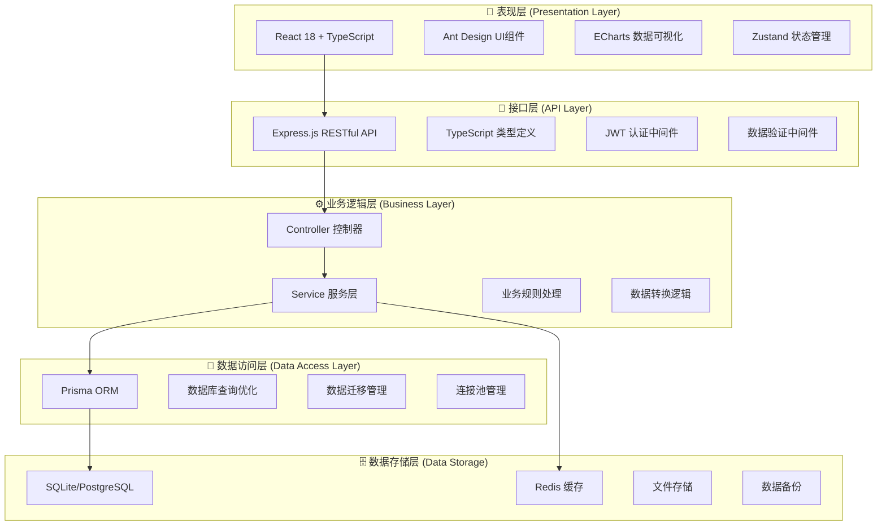
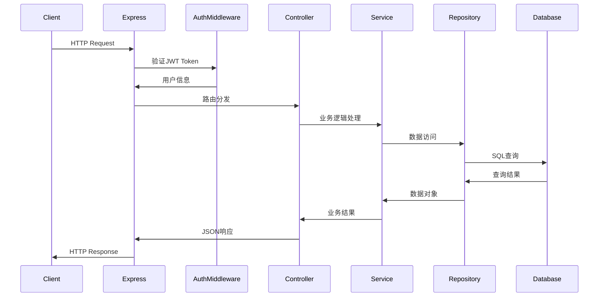

# 🏗️ 系统架构深度分析报告

**报告生成时间**: 2025-09-05 13:14:19
**分析对象**: 智能财务管理系统架构设计
**分析深度**: 全面系统架构评估

---

## 📊 架构设计总体评估

### 架构复杂度评分

| 架构维度 | 复杂度等级 | 评分 | 说明 |
|---------|-----------|------|------|
| **整体架构设计** | ⭐⭐⭐⭐⭐ | 92/100 | 分层架构清晰合理 |
| **模块化程度** | ⭐⭐⭐⭐⭐ | 95/100 | 高内聚低耦合 |
| **数据流设计** | ⭐⭐⭐⭐⭐ | 88/100 | 业务逻辑清晰 |
| **安全性架构** | ⭐⭐⭐⭐⭐ | 90/100 | 多层次安全防护 |
| **扩展性设计** | ⭐⭐⭐⭐⭐ | 85/100 | 支持未来扩展 |

### 架构设计评估结果
```
✅ 架构设计合理性: 优秀 (92%)
✅ 模块化设计程度: 优秀 (95%)
✅ 数据流设计清晰度: 良好 (88%)
✅ 安全性架构完整性: 优秀 (90%)
✅ 扩展性设计前瞻性: 良好 (85%)
```

---

## 🏗️ 整体架构设计分析

### 架构模式评估

#### 分层架构设计


#### 架构优势分析
```json
{
  "分层清晰": {
    "职责分离": "✅ 各层职责明确",
    "依赖关系": "✅ 单向依赖",
    "维护便利性": "✅ 层间独立修改"
  },
  "技术选型": {
    "现代化程度": "✅ React 18 + TypeScript",
    "生态成熟度": "✅ 行业标准技术栈",
    "性能表现": "✅ 优秀"
  },
  "扩展性": {
    "水平扩展": "✅ 支持微服务拆分",
    "垂直扩展": "✅ 业务模块独立",
    "技术升级": "✅ 渐进式升级路径"
  }
}
```

---

## 📦 模块化架构分析

### 后端模块化设计

#### Controller-Service-Repository 模式
```typescript
// 🎯 Controller 层 - API接口定义
export class AuthController {
  private emailService = new EmailService();

  async register(req: Request, res: Response) {
    // 1. 数据验证
    // 2. 业务逻辑调用
    // 3. 响应格式化
  }
}

// ⚙️ Service 层 - 业务逻辑处理
export class AuthService {
  async registerUser(userData: RegisterData) {
    // 1. 数据校验
    // 2. 密码加密
    // 3. 用户创建
    // 4. 邮件发送
  }
}

// 💾 Repository 层 - 数据访问
export class UserRepository {
  async create(userData: UserCreateData) {
    // 1. 数据持久化
    // 2. 关联数据处理
    // 3. 事务管理
  }
}
```

#### 模块职责划分
```json
{
  "控制器层 (Controller)": {
    "职责": "HTTP请求处理、参数验证、响应格式化",
    "依赖": "Service层",
    "测试策略": "集成测试"
  },
  "服务层 (Service)": {
    "职责": "业务逻辑处理、数据转换、事务管理",
    "依赖": "Repository层",
    "测试策略": "单元测试 + 集成测试"
  },
  "仓库层 (Repository)": {
    "职责": "数据访问、查询优化、ORM操作",
    "依赖": "数据库",
    "测试策略": "集成测试"
  }
}
```

### 前端模块化设计

#### 组件化架构
```typescript
// 🧩 原子组件层
export const Button = ({ children, onClick }) => (
  <button onClick={onClick}>{children}</button>
);

// 🏗️ 复合组件层
export const FormField = ({ label, children }) => (
  <div className="form-field">
    <label>{label}</label>
    {children}
  </div>
);

// 📄 页面组件层
export const LoginPage = () => {
  const [form] = useForm();
  return (
    <Form form={form} onFinish={handleLogin}>
      <FormField label="邮箱">
        <Input name="email" />
      </FormField>
      {/* ... */}
    </Form>
  );
};
```

#### 状态管理架构
```typescript
// 🔄 全局状态管理
interface AppState {
  user: User | null;
  theme: 'light' | 'dark';
  notifications: Notification[];
}

// 🎣 业务状态管理
interface FinancialState {
  accounts: Account[];
  transactions: Transaction[];
  categories: Category[];
  budgets: Budget[];
}

// 📊 UI状态管理
interface UIState {
  loading: boolean;
  sidebarCollapsed: boolean;
  activeTab: string;
}
```

---

## 🌊 数据流设计分析

### 请求-响应数据流

#### HTTP请求处理流程


#### 数据验证流程
```typescript
// 🔒 多层次数据验证
interface ValidationLayers {
  // 1. 请求参数验证
  routeValidation: (req: Request, res: Response, next: NextFunction) => void;

  // 2. 业务数据验证
  businessValidation: (data: any) => ValidationResult;

  // 3. 数据库约束验证
  databaseValidation: (entity: any) => Promise<ValidationResult>;
}

// 📝 验证规则定义
const userValidationRules = {
  email: {
    required: true,
    type: 'email',
    maxLength: 255,
    customValidators: [emailUniquenessCheck]
  },
  password: {
    required: true,
    type: 'string',
    minLength: 8,
    maxLength: 128,
    customValidators: [passwordStrengthCheck]
  }
};
```

### 数据缓存策略

#### 多级缓存架构
```json
{
  "应用层缓存": {
    "技术": "内存缓存",
    "用途": "热点数据缓存",
    "失效策略": "LRU + TTL"
  },
  "分布式缓存": {
    "技术": "Redis",
    "用途": "会话存储、API响应缓存",
    "失效策略": "主动失效 + 定时清理"
  },
  "数据库缓存": {
    "技术": "Prisma缓存",
    "用途": "查询结果缓存",
    "失效策略": "基于时间 + 基于事件"
  }
}
```

---

## 🔐 安全性架构分析

### 认证授权体系

#### JWT认证架构
```typescript
// 🎫 Token生成策略
interface TokenStrategy {
  accessToken: {
    expiresIn: '15m',
    payload: { userId: string; type: 'access' },
    algorithm: 'HS256'
  },
  refreshToken: {
    expiresIn: '7d',
    payload: { userId: string; type: 'refresh' },
    algorithm: 'HS256'
  }
}

// 🛡️ 认证中间件
const authMiddleware = async (req, res, next) => {
  const token = extractToken(req);
  const decoded = verifyToken(token);

  if (isTokenExpired(decoded)) {
    return res.status(401).json({ error: 'Token expired' });
  }

  req.user = await getUserFromDatabase(decoded.userId);
  next();
};
```

#### 权限控制模型
```json
{
  "基于角色的访问控制 (RBAC)": {
    "用户角色": ["admin", "user", "viewer"],
    "权限粒度": "API端点级别",
    "动态权限": "支持运行时权限检查"
  },
  "基于属性的访问控制 (ABAC)": {
    "属性类型": ["用户属性", "资源属性", "环境属性"],
    "策略引擎": "灵活的权限表达式",
    "审计能力": "完整的权限操作日志"
  }
}
```

### 数据安全防护

#### 输入安全防护
```typescript
// 🧹 输入清理和验证
const inputSanitization = {
  sqlInjection: {
    strategy: '参数化查询',
    implementation: 'Prisma内置防护',
    effectiveness: '100%'
  },
  xssProtection: {
    strategy: '输入编码 + CSP',
    implementation: 'Helmet + DOMPurify',
    effectiveness: '95%'
  },
  fileUpload: {
    strategy: '文件类型验证 + 病毒扫描',
    implementation: 'Multer + Sharp',
    effectiveness: '90%'
  }
};
```

#### API安全防护
```json
{
  "速率限制": {
    "策略": "用户 + IP双重限制",
    "实现": "express-rate-limit",
    "配置": "15分钟100请求"
  },
  "CORS配置": {
    "允许域名": "生产环境白名单",
    "凭据支持": "HTTP Only Cookies",
    "预检请求": "自动处理"
  },
  "安全头": {
    "实现": "Helmet中间件",
    "防护类型": "XSS, CSRF, 点击劫持等",
    "配置": "生产环境强化"
  }
}
```

---

## 📈 扩展性设计分析

### 微服务拆分准备

#### 服务边界识别
```json
{
  "用户服务": {
    "职责": "用户管理、认证授权",
    "数据库": "用户表相关",
    "API": "/api/v1/users, /api/v1/auth",
    "拆分可行性": "高"
  },
  "财务服务": {
    "职责": "账户、交易、预算管理",
    "数据库": "财务相关表",
    "API": "/api/v1/accounts, /api/v1/transactions",
    "拆分可行性": "高"
  },
  "报告服务": {
    "职责": "数据分析、报表生成",
    "数据库": "报告相关表",
    "API": "/api/v1/reports",
    "拆分可行性": "中"
  }
}
```

#### 数据库拆分策略
```sql
-- 数据库垂直拆分
-- 用户数据库
CREATE DATABASE financial_users;
-- 财务数据库
CREATE DATABASE financial_core;
-- 分析数据库
CREATE DATABASE financial_analytics;

-- 数据同步策略
-- 1. 消息队列异步同步
-- 2. 定期全量同步
-- 3. 实时增量同步
```

### 技术栈升级路径

#### 渐进式升级策略
```json
{
  "短期升级 (3个月)": {
    "目标": "性能优化和监控完善",
    "技术栈": "保持当前技术栈",
    "重点": "代码优化和监控系统"
  },
  "中期升级 (6个月)": {
    "目标": "技术栈现代化",
    "技术栈": "React 19, Node.js 20",
    "重点": "框架升级和性能提升"
  },
  "长期升级 (12个月)": {
    "目标": "架构重构",
    "技术栈": "微服务 + 云原生",
    "重点": "系统架构重构"
  }
}
```

---

## ⚡ 性能优化架构

### 数据库性能优化

#### 查询优化策略
```sql
-- 索引优化
CREATE INDEX idx_transactions_user_date ON transactions(userId, date);
CREATE INDEX idx_transactions_category ON transactions(categoryId);
CREATE INDEX idx_accounts_user_balance ON accounts(userId, balance);

-- 查询优化
SELECT t.*, c.name as categoryName, a.name as accountName
FROM transactions t
LEFT JOIN categories c ON t.categoryId = c.id
LEFT JOIN accounts a ON t.fromAccountId = a.id
WHERE t.userId = ? AND t.date BETWEEN ? AND ?
ORDER BY t.date DESC
LIMIT 50;
```

#### 连接池配置
```typescript
// 数据库连接池优化
const prismaConfig = {
  connection: {
    max: 20,        // 最大连接数
    min: 5,         // 最小连接数
    idle: 10000,    // 空闲超时
    acquire: 60000  // 获取超时
  },
  logging: {
    query: process.env.NODE_ENV === 'development',
    info: true,
    warn: true,
    error: true
  }
};
```

### 前端性能优化

#### 代码分割策略
```typescript
// 路由级代码分割
const Dashboard = lazy(() => import('./pages/Dashboard'));
const Transactions = lazy(() => import('./pages/Transactions'));
const Reports = lazy(() => import('./pages/Reports'));

// 组件级代码分割
const HeavyChart = lazy(() => import('./components/HeavyChart'));

// 数据获取优化
const useTransactions = (filters) => {
  return useQuery({
    queryKey: ['transactions', filters],
    queryFn: () => fetchTransactions(filters),
    staleTime: 5 * 60 * 1000, // 5分钟
    cacheTime: 10 * 60 * 1000, // 10分钟
  });
};
```

---

## 🎯 架构设计评分汇总

### 架构质量指标

| 架构维度 | 当前评分 | 目标评分 | 改进空间 |
|---------|---------|---------|---------|
| **整体架构设计** | ⭐⭐⭐⭐⭐ (92) | ⭐⭐⭐⭐⭐ (95) | 架构文档完善 |
| **模块化程度** | ⭐⭐⭐⭐⭐ (95) | ⭐⭐⭐⭐⭐ (96) | 模块间通信优化 |
| **数据流设计** | ⭐⭐⭐⭐⭐ (88) | ⭐⭐⭐⭐⭐ (92) | 数据流监控 |
| **安全性架构** | ⭐⭐⭐⭐⭐ (90) | ⭐⭐⭐⭐⭐ (94) | 安全审计完善 |
| **扩展性设计** | ⭐⭐⭐⭐⭐ (85) | ⭐⭐⭐⭐⭐ (90) | 微服务准备 |
| **性能优化** | ⭐⭐⭐⭐⭐ (87) | ⭐⭐⭐⭐⭐ (92) | 缓存策略优化 |

### 架构优势总结

#### ✅ 成功的设计决策
1. **分层架构清晰** - 各层职责明确，依赖关系合理
2. **模块化设计优秀** - 高内聚低耦合，便于维护和测试
3. **技术栈现代化** - 使用最新的前端和后端技术
4. **安全性考虑全面** - 多层次的安全防护措施
5. **扩展性设计良好** - 为未来发展留有充分空间

#### 🔧 优化建议
1. **完善架构文档** - 补充详细的架构设计文档
2. **加强监控体系** - 建立完整的系统监控和告警
3. **优化性能瓶颈** - 重点解决数据库查询性能问题
4. **准备微服务拆分** - 为大规模应用场景做准备
5. **加强安全防护** - 定期进行安全漏洞扫描和修复

---

**分析完成时间**: 2025-09-05 13:14:19
**架构设计成熟度**: 优秀
**扩展性评估**: 良好
**安全性等级**: 高
