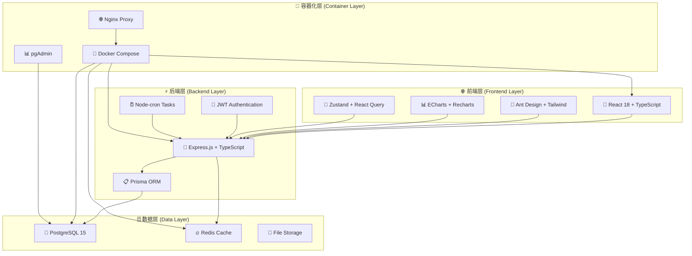
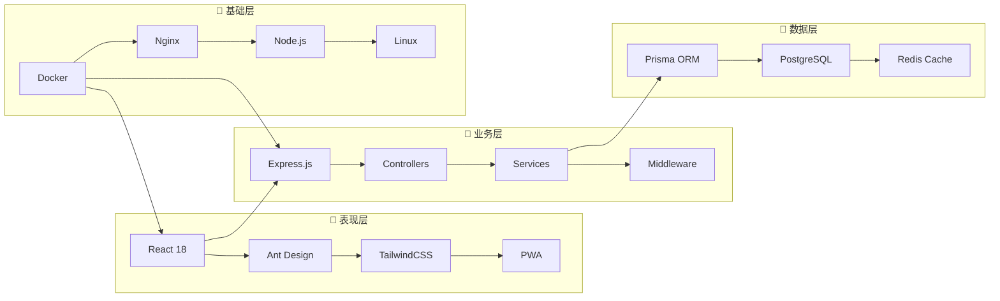

# 🏗️ 智能财务管理系统 - 增强版项目结构

<div align="center">

## 📊 系统架构概览图



</div>

---

## 🏛️ 详细目录结构图

```
🏢 智能财务管理系统 (Financial Management System)
│
├── 🎯 核心应用模块 (Core Application Modules)
│   │
│   ├── 🖥️ frontend/ ────────────────────── 前端应用 (React SPA)
│   │   ├── 📁 src/
│   │   │   ├── 🧩 components/           ⚡ 可复用UI组件
│   │   │   │   ├── 💰 FinancialCard/    └─ 财务卡片组件
│   │   │   │   ├── 📊 ChartWidgets/     └─ 图表组件库
│   │   │   │   ├── 📱 MobileOptimized/  └─ 移动端组件
│   │   │   │   └── 🔧 Common/           └─ 通用组件
│   │   │   ├── 📄 pages/                ⚡ 页面路由组件
│   │   │   │   ├── 🏠 Dashboard/        └─ 仪表板页面
│   │   │   │   ├── 💳 Transactions/     └─ 交易管理页面
│   │   │   │   ├── 📊 Analytics/        └─ 数据分析页面
│   │   │   │   ├── ⚙️ Settings/         └─ 系统设置页面
│   │   │   │   └── 🔐 Auth/             └─ 认证页面
│   │   │   ├── 🔗 services/             ⚡ API服务层
│   │   │   │   ├── 🌐 api.ts            └─ API基础配置
│   │   │   │   ├── 💰 financial.ts      └─ 财务API服务
│   │   │   │   ├── 🔐 auth.ts           └─ 认证API服务
│   │   │   │   └── 📊 analytics.ts      └─ 分析API服务
│   │   │   ├── 🗃️ store/                ⚡ 状态管理 (Zustand)
│   │   │   │   ├── 🔐 authStore.ts      └─ 认证状态
│   │   │   │   ├── 💰 financialStore.ts └─ 财务数据状态
│   │   │   │   └── 🎨 uiStore.ts        └─ UI状态管理
│   │   │   ├── 🛠️ utils/                ⚡ 工具函数库
│   │   │   │   ├── 💱 formatCurrency.ts └─ 货币格式化
│   │   │   │   ├── 📅 dateUtils.ts      └─ 日期处理
│   │   │   │   ├── 📊 chartHelpers.ts   └─ 图表辅助函数
│   │   │   │   └── 📱 responsive.ts     └─ 响应式工具
│   │   │   ├── 🎨 layouts/              ⚡ 布局组件
│   │   │   │   ├── 📱 MobileLayout.tsx  └─ 移动端布局
│   │   │   │   ├── 🖥️ DesktopLayout.tsx └─ 桌面端布局
│   │   │   │   └── 📊 DashboardLayout.tsx └─ 仪表板布局
│   │   │   └── 🪝 hooks/                ⚡ 自定义React Hooks
│   │   │       ├── 🔍 useLocalStorage.ts └─ 本地存储Hook
│   │   │       ├── 📱 useResponsive.ts  └─ 响应式Hook
│   │   │       └── 💰 useFinancial.ts   └─ 财务数据Hook
│   │   ├── 🌐 public/                   ⚡ 静态资源
│   │   │   ├── 🏠 manifest.json         └─ PWA配置文件
│   │   │   ├── 🎨 icons/                └─ 应用图标
│   │   │   └── 📄 index.html            └─ HTML模板
│   │   ├── 📦 package.json              ⚡ 前端依赖配置
│   │   ├── ⚙️ vite.config.ts            ⚡ Vite构建配置
│   │   ├── 🎨 tailwind.config.js        ⚡ Tailwind CSS配置
│   │   └── 🐳 Dockerfile                ⚡ 前端容器镜像
│   │
│   ├── ⚡ backend/ ──────────────────────── 后端应用 (Node.js API)
│   │   ├── 📁 src/
│   │   │   ├── 🎛️ controllers/          ⚡ 控制器层 (MVC架构)
│   │   │   │   ├── 🔐 authController.ts └─ 认证控制器
│   │   │   │   ├── 💰 transactionController.ts └─ 交易控制器
│   │   │   │   ├── 👤 userController.ts └─ 用户控制器
│   │   │   │   ├── 📊 analyticsController.ts └─ 分析控制器
│   │   │   │   └── 📄 reportController.ts └─ 报告控制器
│   │   │   ├── 🛡️ middleware/           ⚡ 中间件层
│   │   │   │   ├── 🔐 auth.ts           └─ 认证中间件
│   │   │   │   ├── 🛡️ security.ts       └─ 安全中间件
│   │   │   │   ├── 📝 logging.ts        └─ 日志中间件
│   │   │   │   ├── 🚦 rateLimit.ts      └─ 限流中间件
│   │   │   │   └── ✅ validation.ts     └─ 数据验证中间件
│   │   │   ├── 🔀 routes/               ⚡ 路由定义
│   │   │   │   ├── 🔐 auth.ts           └─ 认证路由
│   │   │   │   ├── 💰 transactions.ts   └─ 交易路由
│   │   │   │   ├── 👤 users.ts          └─ 用户路由
│   │   │   │   ├── 📊 analytics.ts      └─ 分析路由
│   │   │   │   └── 📄 reports.ts        └─ 报告路由
│   │   │   ├── 🔧 services/             ⚡ 业务逻辑层
│   │   │   │   ├── 💰 financialService.ts └─ 财务业务逻辑
│   │   │   │   ├── 📊 analyticsService.ts └─ 数据分析服务
│   │   │   │   ├── 📧 emailService.ts   └─ 邮件服务
│   │   │   │   ├── 📄 pdfService.ts     └─ PDF生成服务
│   │   │   │   └── 📊 excelService.ts   └─ Excel处理服务
│   │   │   ├── 🔧 utils/                ⚡ 工具函数
│   │   │   │   ├── 🔒 encryption.ts     └─ 加密工具
│   │   │   │   ├── 📅 dateHelper.ts     └─ 日期处理
│   │   │   │   ├── ✅ validator.ts      └─ 数据验证
│   │   │   │   └── 📝 logger.ts         └─ 日志工具
│   │   │   └── 🏁 index.ts              ⚡ 应用程序入口
│   │   ├── 🗄️ prisma/                   ⚡ 数据库管理 (Prisma ORM)
│   │   │   ├── 📋 schema.prisma         └─ 数据库模型定义
│   │   │   ├── 🌱 seed.ts               └─ 种子数据脚本
│   │   │   └── 📊 migrations/           └─ 数据库迁移文件
│   │   ├── 🧪 tests/                    ⚡ 测试文件
│   │   │   ├── 🔧 unit/                 └─ 单元测试
│   │   │   ├── 🔗 integration/          └─ 集成测试
│   │   │   └── 🎯 e2e/                  └─ 端到端测试
│   │   ├── 📦 package.json              ⚡ 后端依赖配置
│   │   ├── ⚙️ tsconfig.json             ⚡ TypeScript配置
│   │   └── 🐳 Dockerfile                ⚡ 后端容器镜像
│   │
│   └── 🗃️ database/ ────────────────────── 数据库配置
│       ├── 📄 init.sql                  ⚡ 数据库初始化脚本
│       ├── 🔧 migrations/               ⚡ 手动迁移脚本
│       └── 🌱 seeds/                    ⚡ 测试数据种子
│
├── 🔧 开发工具与配置 (Development Tools & Config)
│   │
│   ├── ⚙️ config/ ──────────────────────── 配置管理
│   │   ├── 📦 package.json              ⚡ 全局工具依赖
│   │   ├── 📋 requirements.txt          ⚡ Python依赖
│   │   ├── 🔧 eslint.config.js          ⚡ ESLint配置
│   │   ├── 🎨 prettier.config.js        ⚡ Prettier配置
│   │   └── 🧪 jest.config.js            ⚡ Jest测试配置
│   │
│   ├── 📜 scripts/ ─────────────────────── 自动化脚本
│   │   ├── 🚀 development/              ⚡ 开发脚本
│   │   │   ├── 🚀 quick-start.ps1       └─ Windows快速启动
│   │   │   ├── 🚀 start-dev.sh          └─ Linux开发启动
│   │   │   ├── 🔄 hot-reload.sh         └─ 热重载脚本
│   │   │   └── 📱 mobile-dev.sh         └─ 移动端开发脚本
│   │   ├── 🔧 setup/                    ⚡ 环境配置脚本
│   │   │   ├── 🔧 setup.sh              └─ 一键环境配置
│   │   │   ├── 🐳 docker-setup.sh       └─ Docker环境配置
│   │   │   ├── 🗄️ db-setup.sh           └─ 数据库配置
│   │   │   └── 📱 mobile-setup.sh       └─ 移动端环境配置
│   │   ├── 🛠️ maintenance/              ⚡ 维护脚本
│   │   │   ├── 🛠️ fix-login.sh          └─ 登录问题修复
│   │   │   ├── 🔄 update-stats.py       └─ 统计数据更新
│   │   │   ├── 🧹 cleanup.sh            └─ 清理脚本
│   │   │   └── 🔍 health-check.sh       └─ 健康检查
│   │   └── 🚀 deployment/               ⚡ 部署脚本
│   │       ├── 🚢 deploy-prod.sh        └─ 生产环境部署
│   │       ├── 🧪 deploy-staging.sh     └─ 测试环境部署
│   │       ├── 🔄 rollback.sh           └─ 回滚脚本
│   │       └── 📊 deploy-monitor.sh     └─ 部署监控
│   │
│   └── 🐳 docker/ ─────────────────────── Docker容器化
│       ├── 📋 orchestration/            ⚡ 容器编排
│       │   ├── 📋 docker-compose.yml    └─ 主编排文件
│       │   ├── 🧪 docker-compose.dev.yml └─ 开发环境
│       │   ├── 🚀 docker-compose.prod.yml └─ 生产环境
│       │   └── 📱 docker-compose.mobile.yml └─ 移动端测试
│       ├── 🏗️ dockerfiles/             ⚡ 自定义镜像
│       │   ├── 🖥️ frontend.Dockerfile   └─ 前端镜像
│       │   ├── ⚡ backend.Dockerfile    └─ 后端镜像
│       │   ├── 🗄️ database.Dockerfile   └─ 数据库镜像
│       │   └── 🌐 nginx.Dockerfile      └─ Nginx代理镜像
│       ├── 📜 scripts/                  ⚡ Docker脚本
│       │   ├── 🔄 pull-images.sh        └─ 镜像拉取
│       │   ├── 🏗️ build-all.sh          └─ 批量构建
│       │   ├── 🧹 cleanup.sh            └─ 容器清理
│       │   └── 🔍 health-check.sh       └─ 健康检查
│       └── 🔧 config/                   ⚡ Docker配置
│           ├── 🌐 nginx.conf            └─ Nginx配置
│           ├── 🔧 daemon.json           └─ Docker守护进程
│           └── 🔐 .dockerignore         └─ Docker忽略文件
│
├── 📊 数据处理与分析 (Data Processing & Analytics)
│   │
│   ├── 💰 wx-alipaycounts/ ─────────────── 支付数据处理
│   │   ├── 💚 wxpay/                    ⚡ 微信支付数据
│   │   │   ├── 📊 processors/           └─ 数据处理器
│   │   │   ├── 📄 templates/            └─ 导入模板
│   │   │   └── 🗂️ archives/             └─ 历史账单存档
│   │   ├── 💙 alipay/                   ⚡ 支付宝数据
│   │   │   ├── 📊 processors/           └─ 数据处理器
│   │   │   ├── 📄 templates/            └─ 导入模板
│   │   │   └── 🗂️ archives/             └─ 历史账单存档
│   │   └── 🔧 utils/                    ⚡ 支付数据工具
│   │       ├── 🔄 parsers.py            └─ 数据解析器
│   │       ├── ✅ validators.py         └─ 数据验证器
│   │       └── 📊 analyzers.py          └─ 数据分析器
│   │
│   ├── 📈 quantification/ ──────────────── 项目量化分析
│   │   ├── 📊 stats/                    ⚡ 统计数据
│   │   │   ├── 📊 project-stats.json    └─ 项目统计数据
│   │   │   ├── 📄 project-stats.md      └─ 统计报告
│   │   │   └── 📈 trends.json           └─ 趋势数据
│   │   ├── 🔄 generators/               ⚡ 统计生成器
│   │   │   ├── 🔄 update_stats.py       └─ Python统计脚本
│   │   │   ├── ⚡ update-stats.js        └─ Node.js统计脚本
│   │   │   └── 💻 Update-ProjectStats.ps1 └─ PowerShell脚本
│   │   └── ⚙️ config/                   ⚡ 统计配置
│   │       ├── ⚙️ stats-config.json     └─ 统计配置文件
│   │       └── 📋 metrics.json          └─ 指标定义
│   │
│   └── 📊 tradingimages/ ───────────────── 交易分析工具
│       ├── 💹 economicdataserieslist/   ⚡ 经济数据分析
│       │   ├── 📊 fed_indicators_analysis.xlsx └─ Fed指标分析
│       │   ├── 📄 analysis_reports/     └─ 分析报告
│       │   └── 🗄️ data_archives/        └─ 数据存档
│       ├── 🛠️ itpm-tools/               ⚡ 交易分析工具集
│       │   ├── 🔧 analyzers/            └─ 分析工具
│       │   ├── 📊 visualizers/          └─ 可视化工具
│       │   └── 🤖 predictors/           └─ 预测模型
│       ├── 📈 trading_strategies/       ⚡ 交易策略
│       │   ├── 📚 potm/                 └─ 交易策略原理
│       │   ├── 🎯 pftm/                 └─ 财务交易管理
│       │   └── 📊 ptm/                  └─ 高级交易策略
│       └── 🎓 learning_resources/       ⚡ 学习资源
│           ├── 📚 iplt/                 └─ 投资学习工具
│           ├── 📖 guides/               └─ 学习指南
│           └── 🧠 mindmaps/             └─ 思维导图
│
├── 📚 文档与示例 (Documentation & Examples)
│   │
│   ├── 📖 docs/ ───────────────────────── 项目文档
│   │   ├── 🏗️ architecture/            ⚡ 架构文档
│   │   │   ├── 📋 PROJECT_STRUCTURE.md  └─ 项目结构说明
│   │   │   ├── 🏛️ SYSTEM_DESIGN.md     └─ 系统设计文档
│   │   │   └── 🔧 TECH_STACK.md         └─ 技术栈说明
│   │   ├── 🚀 guides/                  ⚡ 使用指南
│   │   │   ├── 🚀 QUICK_START.md        └─ 快速开始指南
│   │   │   ├── 🚢 DEPLOYMENT_GUIDE.md   └─ 部署指南
│   │   │   ├── 👨‍💻 DEVELOPMENT_GUIDE.md └─ 开发指南
│   │   │   └── 📱 MOBILE_GUIDE.md       └─ 移动端指南
│   │   ├── 📋 features/                ⚡ 功能文档
│   │   │   ├── 💰 TRANSACTIONS_GUIDE.md └─ 交易功能指南
│   │   │   ├── 📊 BI_VISUALIZATION.md   └─ BI可视化文档
│   │   │   ├── 📱 MOBILE_FEATURES.md    └─ 移动端功能
│   │   │   └── 🤖 AI_FEATURES.md        └─ AI功能说明
│   │   └── 🔗 api/                     ⚡ API文档
│   │       ├── 🔗 API_DESIGN.md         └─ API设计文档
│   │       ├── 📚 API_REFERENCE.md      └─ API参考手册
│   │       └── 🔧 API_TESTING.md        └─ API测试指南
│   │
│   ├── 🎮 examples/ ───────────────────── 示例代码
│   │   ├── 🖥️ demo/                    ⚡ 功能演示
│   │   │   ├── 🖥️ desktop_demo.html    └─ 桌面端演示
│   │   │   ├── 📱 mobile_demo.html      └─ 移动端演示
│   │   │   └── 📊 analytics_demo.html   └─ 分析功能演示
│   │   ├── 🧪 test/                    ⚡ 测试示例
│   │   │   ├── 🔐 auth_test.html        └─ 认证测试
│   │   │   ├── 💰 transaction_test.js   └─ 交易功能测试
│   │   │   └── 📊 analytics_test.js     └─ 分析功能测试
│   │   └── 🎓 tutorials/               ⚡ 教程示例
│   │       ├── 🌟 basic_setup.md       └─ 基础设置教程
│   │       ├── 🔧 advanced_config.md   └─ 高级配置教程
│   │       └── 🚀 deployment_tutorial.md └─ 部署教程
│   │
│   └── 🚀 deployment/ ─────────────────── 部署配置
│       ├── 🐳 docker/                  ⚡ Docker部署
│       │   ├── 🏠 local/               └─ 本地部署配置
│       │   ├── 🧪 staging/             └─ 测试环境配置
│       │   └── 🚀 production/          └─ 生产环境配置
│       ├── ☁️ cloud/                   ⚡ 云部署
│       │   ├── ☁️ aws/                  └─ AWS部署配置
│       │   ├── ☁️ azure/                └─ Azure部署配置
│       │   └── ☁️ gcp/                  └─ GCP部署配置
│       └── 📜 scripts/                 ⚡ 部署脚本
│           ├── 🚀 auto_deploy.sh       └─ 自动部署脚本
│           ├── 🔄 update_system.sh     └─ 系统更新脚本
│           └── 🛡️ security_setup.sh    └─ 安全配置脚本
│
├── 🔧 系统支持文件 (System Support Files)
│   │
│   ├── 📋 README.md ───────────────────── 项目说明文档
│   ├── 🐳 docker-compose.yml ─────────── 主容器编排文件
│   ├── 🚀 quick-launch.py ────────────── 快速启动器
│   ├── 📝 .gitignore ─────────────────── Git忽略规则
│   ├── 📄 LICENSE ────────────────────── 开源许可证
│   ├── 📊 CHANGELOG.md ───────────────── 更新日志
│   ├── 🤝 CONTRIBUTING.md ────────────── 贡献指南
│   └── 📊 logs/ ──────────────────────── 系统日志
│       ├── 📊 application.log          └─ 应用日志
│       ├── 🔐 security.log             └─ 安全日志
│       ├── 🚨 error.log                └─ 错误日志
│       └── 📈 performance.log          └─ 性能日志
│
└── 🔧 开发环境支持 (Development Environment Support)
    │
    ├── 🐍 venv/ ──────────────────────── Python虚拟环境
    │   ├── 📦 lib/                     └─ Python库
    │   ├── 🔧 bin/                     └─ 可执行文件
    │   └── ⚙️ pyvenv.cfg               └─ 虚拟环境配置
    │
    ├── 📁 node_modules/ ──────────────── Node.js依赖
    │   ├── 📦 .bin/                    └─ 可执行脚本
    │   └── 📚 packages/                └─ 依赖包
    │
    ├── 🏠 ~/.config/ ─────────────────── 用户配置
    │   ├── 🐳 docker/                  └─ Docker用户配置
    │   ├── 🔧 git/                     └─ Git配置
    │   └── ⚙️ vscode/                  └─ VSCode配置
    │
    └── 🔧 .vscode/ ───────────────────── VSCode工作区配置
        ├── ⚙️ settings.json            └─ 编辑器设置
        ├── 🚀 launch.json              └─ 调试配置
        ├── 🔧 tasks.json               └─ 任务配置
        └── 📦 extensions.json          └─ 推荐扩展
```

---

## 🎯 技术栈分层架构

<div align="center">



</div>

---

## 🏷️ 图例说明

| 图标 | 含义 | 说明 |
|------|------|------|
| 🏢 | 主项目 | 智能财务管理系统根目录 |
| 🖥️ | 前端 | React + TypeScript前端应用 |
| ⚡ | 后端 | Node.js + Express后端API |
| 🗄️ | 数据库 | PostgreSQL + Redis数据层 |
| 🐳 | 容器 | Docker容器化部署 |
| 📱 | 移动端 | 移动端适配和PWA支持 |
| 🔐 | 安全 | 认证、授权、加密相关 |
| 📊 | 分析 | 数据分析和可视化功能 |
| 🛠️ | 工具 | 开发工具和辅助脚本 |
| 📚 | 文档 | 项目文档和使用指南 |
| ⚙️ | 配置 | 系统配置和环境设置 |
| 🚀 | 部署 | 部署脚本和生产环境 |

---

*此文档由系统自动生成并持续更新 🤖*